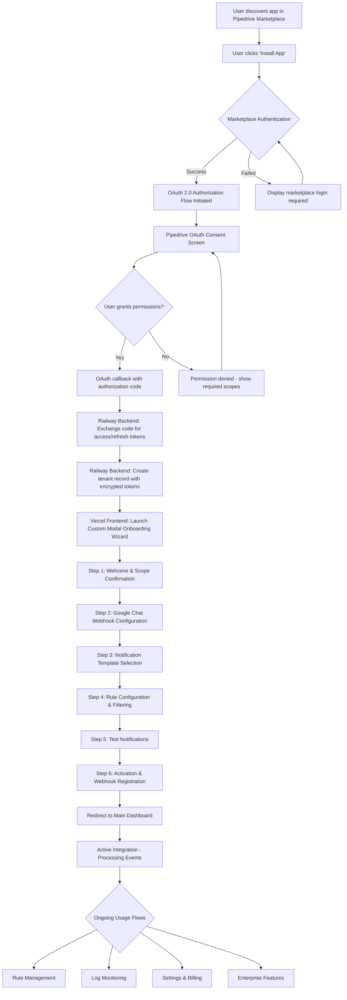
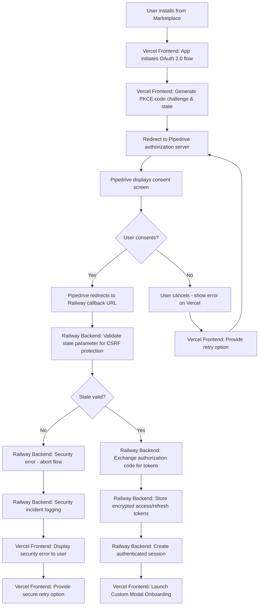
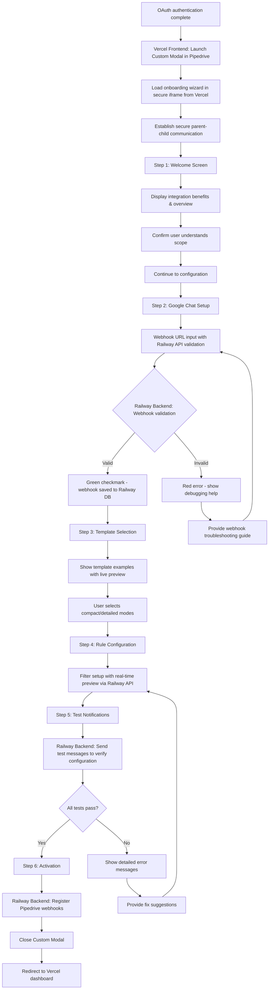
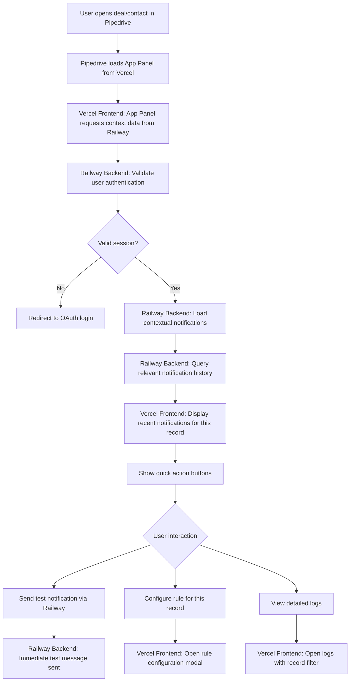
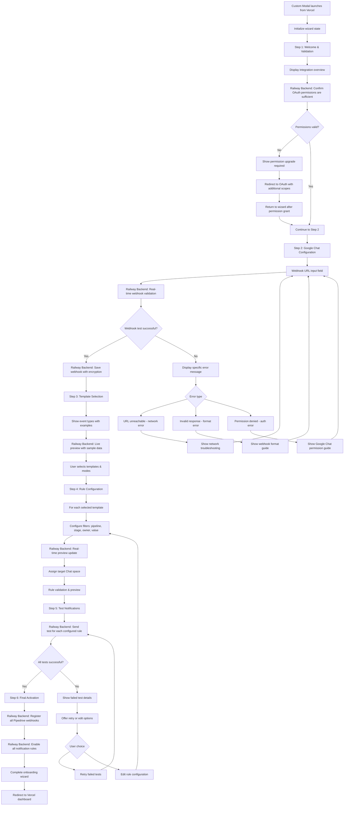
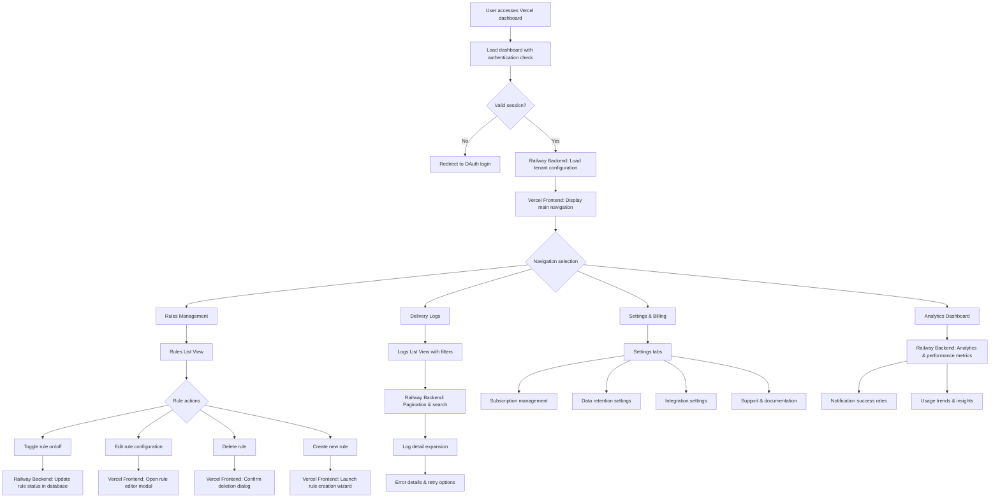
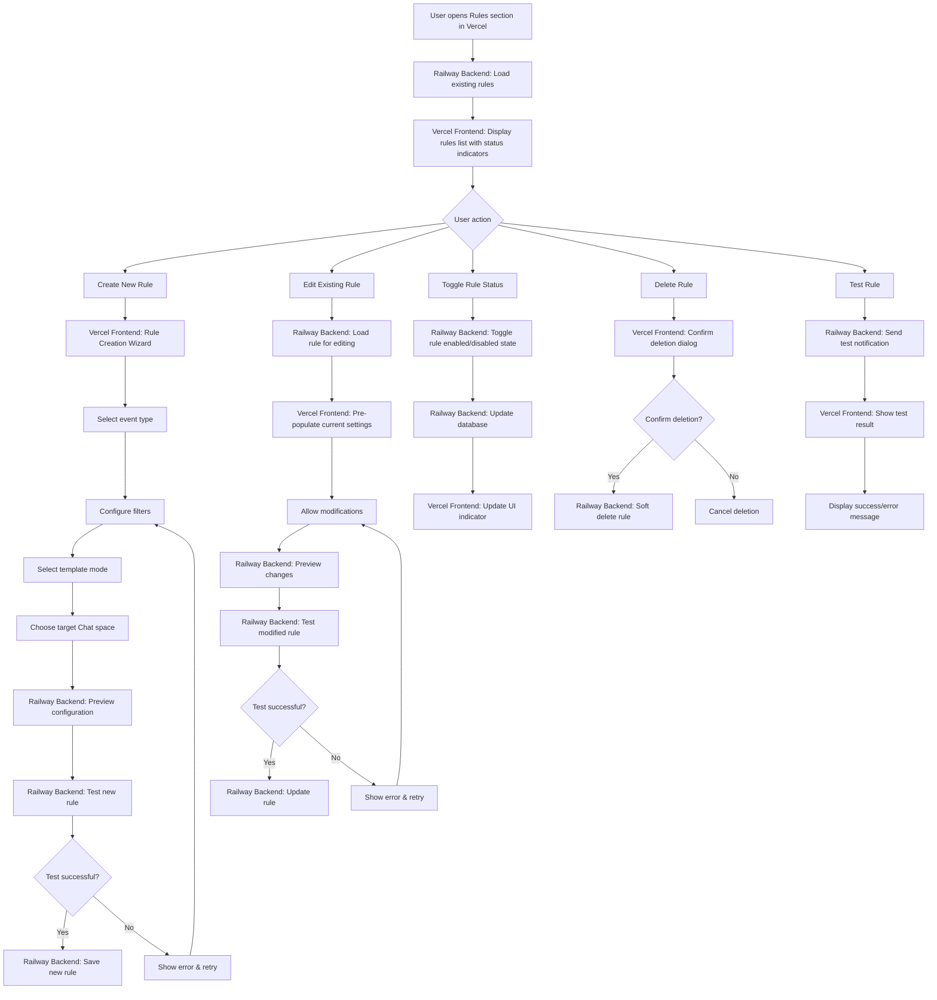
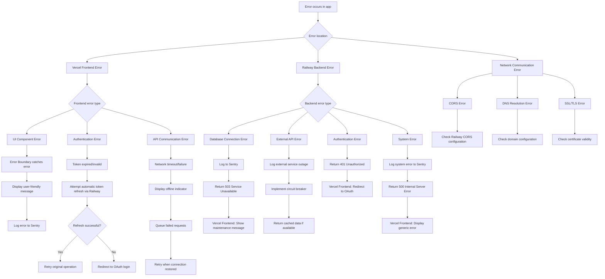
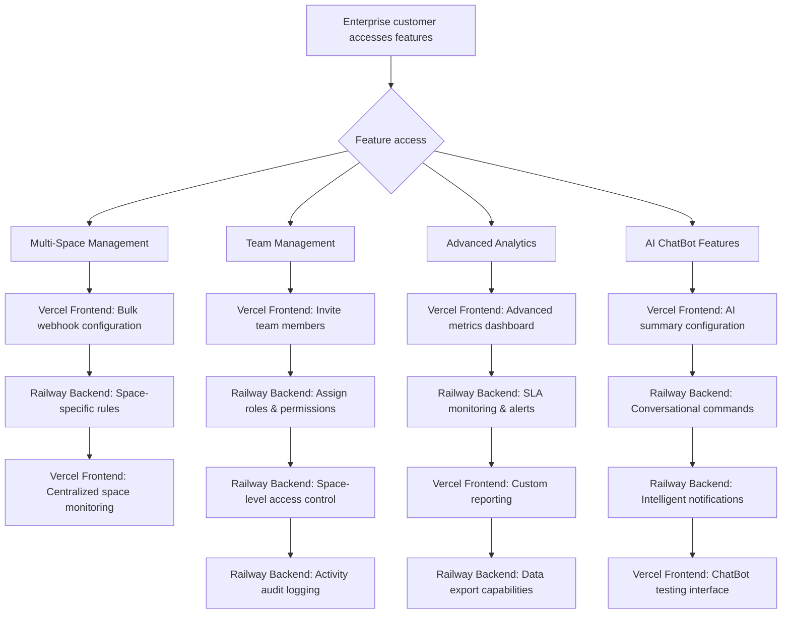

# Marketplace-Compliant App Flowchart Document

This comprehensive **App Flowchart Document** provides detailed visual workflows for the Pipedrive → Google Chat Integration, specifically designed for **Pipedrive Marketplace approval** and **enterprise customer success** using **Railway backend + Vercel frontend architecture**. Every flow prioritizes **OAuth 2.0 compliance**, **Custom UI Extensions**, and **enterprise-grade user experience**.

## 1. Overview: Enterprise App Flow Architecture

Our app flow architecture is designed for **marketplace success** with **OAuth-first authentication**, **native Pipedrive integration**, and **enterprise scalability**. The complete user journey spans from marketplace installation through active usage with comprehensive error handling and security compliance using our optimized **Railway + Vercel deployment strategy**.

### Core Flow Principles

- **OAuth-First Security**: Every interaction begins with proper OAuth 2.0 authentication and authorization
- **Native Integration**: Custom UI Extensions provide seamless Pipedrive experience throughout all flows  
- **Progressive Disclosure**: Complex enterprise features revealed progressively to maintain simple initial experience
- **Error Resilience**: Comprehensive error handling with clear recovery paths at every decision point
- **Marketplace Compliance**: All flows meet Pipedrive Marketplace standards for approval and ongoing compliance
- **Split Architecture**: Railway backend handles secure API operations while Vercel frontend delivers global performance

## 2. Primary User Flow: Complete Journey Map



## 3. OAuth 2.0 Authentication Flow (Railway Backend Processing)



## 4. Custom UI Extensions Integration Flow (Vercel-hosted UI)

### 4.1 Custom Modal Onboarding Flow



### 4.2 App Panel Contextual Integration



## 5. Onboarding Wizard Detailed Flow (Vercel UI + Railway Processing)



## 6. Main Dashboard Navigation Flow (Vercel Frontend + Railway API)



## 7. Rule Management Flow (Vercel UI + Railway Processing)



## 8. Error Handling & Recovery Flows (Cross-Platform)



## 9. Subscription & Billing Flow (Vercel UI + Marketplace Integration)

```mermaid
flowchart TD
    A[User accesses subscription settings in Vercel] --> B[Railway Backend: Load current subscription status]
    B --> C[Vercel Frontend: Display plan details & usage]
    C --> D{Current plan}
    
    D --> E[Trial (7 days remaining)]
    D --> F[Professional Plan]
    D --> G[Enterprise Plan]
    
    E --> H[Show trial status with countdown]
    H --> I[Display upgrade options]
    I --> J[Professional upgrade button]
    I --> K[Enterprise upgrade button]
    
    J --> L[Redirect to Pipedrive Marketplace billing]
    K --> L
    
    L --> M[Pipedrive Marketplace billing flow]
    M --> N[User completes payment]
    N --> O[Railway Backend: Billing webhook received]
    O --> P[Railway Backend: Update subscription in database]
    P --> Q[Railway Backend: Unlock plan features]
    Q --> R[Vercel Frontend: Confirm upgrade success]
    
    F --> S[Show Professional plan benefits]
    S --> T[Option to upgrade to Enterprise]
    T --> U[Enterprise upgrade flow]
    
    G --> V[Show Enterprise features]
    V --> W[Usage analytics & insights]
    W --> X[Advanced configuration options]
    
    % Billing failure paths
    N --> Y{Payment failed?}
    Y -->|Yes| Z[Show payment error]
    Z --> AA[Retry payment option]
    AA --> M
    Y -->|No| O
```

## 10. Enterprise Features Flow (Vercel UI + Railway Processing)



## 11. Security & Compliance Flows (Railway-Enforced Security)

```mermaid
flowchart TD
    A[Security-sensitive operation initiated] --> B[Railway Backend: Validate user authentication]
    B --> C{Valid OAuth session?}
    C -->|No| D[Redirect to OAuth login]
    C -->|Yes| E[Railway Backend: Check authorization for operation]
    
    E --> F{User authorized?}
    F -->|No| G[Return 403 Forbidden to Vercel]
    F -->|Yes| H[Railway Backend: Validate input data]
    
    H --> I[Railway Backend: Sanitize and validate all inputs]
    I --> J[Railway Backend: Apply rate limiting]
    J --> K{Rate limit exceeded?}
    K -->|Yes| L[Return 429 Too Many Requests]
    K -->|No| M[Railway Backend: Execute operation]
    
    M --> N[Railway Backend: Log security event]
    N --> O[Railway Backend: Audit trail recording]
    O --> P[Operation complete]
    
    G --> Q[Vercel Frontend: Display insufficient permissions]
    L --> R[Vercel Frontend: Show rate limit error with reset time]
    
    % Data handling compliance
    A --> S{Sensitive data involved?}
    S -->|Yes| T[Railway Backend: Apply encryption]
    T --> U[Railway Backend: PII masking in logs]
    U --> V[Railway Backend: GDPR compliance check]
    V --> W[Railway Backend: Data retention policies]
```

## 12. Monitoring & Health Check Flows (Cross-Platform Monitoring)

```mermaid
flowchart TD
    A[System monitoring initiated] --> B[Health check endpoints]
    B --> C{Service health}
    
    C --> D[Railway Backend: Database connectivity]
    C --> E[Railway Backend: Redis queue health]
    C --> F[Railway Backend: External API availability]
    C --> G[Railway Backend: Authentication service status]
    C --> H[Vercel Frontend: CDN performance]
    C --> I[Vercel Frontend: Build status]
    
    D --> J{DB responsive?}
    J -->|No| K[Railway: Alert operations team]
    J -->|Yes| L[Record healthy status]
    
    E --> M{Queue processing?}
    M -->|No| N[Railway: Restart queue workers]
    M -->|Yes| O[Monitor queue depth]
    
    F --> P{APIs accessible?}
    P -->|No| Q[Log external service outage]
    P -->|Yes| R[Continue normal operation]
    
    G --> S{OAuth service available?}
    S -->|No| T[Enable maintenance mode]
    S -->|Yes| U[Normal authentication flow]
    
    H --> V{CDN performance optimal?}
    V -->|No| W[Vercel: Alert on CDN issues]
    V -->|Yes| X[Normal frontend delivery]
    
    I --> Y{Build deployment successful?}
    Y -->|No| Z[Vercel: Rollback to previous version]
    Y -->|Yes| AA[Latest version active]
    
    % Cross-platform performance monitoring
    A --> BB[Performance metrics collection]
    BB --> CC[Railway: API response time tracking]
    CC --> DD[Vercel: Frontend loading time tracking]
    DD --> EE[End-to-end user experience monitoring]
    EE --> FF[Automated alerting for both platforms]
```

## 13. Data Retention & Compliance Flow (Railway-Managed Data)

```mermaid
flowchart TD
    A[Railway Backend: Data retention job scheduled] --> B[Identify records for cleanup]
    B --> C{Record age > 90 days?}
    C -->|Yes| D[Check for deletion requests]
    C -->|No| E[Skip record]
    
    D --> F{Manual deletion requested?}
    F -->|Yes| G[Prioritize for immediate deletion]
    F -->|No| H[Standard 90-day cleanup]
    
    G --> I[Railway Backend: Verify deletion authorization]
    I --> J{Authorized?}
    J -->|Yes| K[Railway Backend: Secure data deletion]
    J -->|No| L[Railway Backend: Log unauthorized deletion attempt]
    
    H --> M[Railway Backend: Automated retention cleanup]
    M --> N[Railway Backend: Secure data deletion]
    
    K --> O[Railway Backend: Record deletion audit log]
    N --> O
    O --> P[Railway Backend: Verify data completely removed]
    P --> Q[Railway Backend: Update compliance records]
    
    % GDPR compliance
    A --> R[Vercel Frontend: "Right to be forgotten" request]
    R --> S[Railway Backend: Validate user identity]
    S --> T[Railway Backend: Identify all user data]
    T --> U[Railway Backend: Secure complete data deletion]
    U --> V[Railway Backend: Generate compliance certificate]
    V --> W[Vercel Frontend: Display confirmation to user]
```

## 14. Deployment & Infrastructure Flow (Railway + Vercel)

```mermaid
flowchart TD
    A[Developer commits to main branch] --> B[GitHub Actions triggered]
    B --> C{Deploy target}
    
    C --> D[Backend changes detected]
    C --> E[Frontend changes detected]
    C --> F[Both changed]
    
    D --> G[Railway Deployment Pipeline]
    G --> H[Railway: Build Docker image]
    H --> I[Railway: Run backend tests]
    I --> J{Tests pass?}
    J -->|No| K[Railway: Deployment failed]
    J -->|Yes| L[Railway: Deploy to production]
    L --> M[Railway: Health checks]
    M --> N[Railway: Update environment]
    
    E --> O[Vercel Deployment Pipeline]
    O --> P[Vercel: Build React application]
    P --> Q[Vercel: Run frontend tests]
    Q --> R{Tests pass?}
    R -->|No| S[Vercel: Build failed]
    R -->|Yes| T[Vercel: Deploy to global CDN]
    T --> U[Vercel: Update DNS records]
    U --> V[Vercel: Edge cache invalidation]
    
    F --> W[Parallel deployment]
    W --> G
    W --> O
    
    % Environment synchronization
    N --> X[Update CORS configuration for new Vercel domain]
    V --> Y[Update API endpoints for new Railway URL]
    
    % Success paths
    N --> Z[Backend deployment complete]
    V --> AA[Frontend deployment complete]
    Z --> BB[Integration health check]
    AA --> BB
    BB --> CC[Full system operational]
    
    % Failure handling
    K --> DD[Rollback Railway deployment]
    S --> EE[Rollback Vercel deployment]
    DD --> FF[Alert development team]
    EE --> FF
```

## 15. Conclusion: Railway + Vercel Flow Excellence

This **marketplace-compliant app flowchart** ensures **Pipedrive Marketplace approval** and **enterprise customer success** through our optimized **Railway backend + Vercel frontend architecture**:

### Railway Backend Excellence
- **Secure OAuth processing** with encrypted token storage
- **High-performance API endpoints** with proper rate limiting and security
- **Reliable webhook processing** with BullMQ job queuing
- **Enterprise-grade database operations** with proper tenant isolation
- **Comprehensive logging and monitoring** for operational excellence

### Vercel Frontend Excellence  
- **Global CDN performance** ensuring fast loading worldwide
- **Responsive UI components** optimized for all devices
- **Real-time user feedback** with proper error handling
- **Custom Modal integration** providing native Pipedrive experience
- **Automatic deployment** with rollback capabilities

### Architecture Benefits
- **Cost Optimization**: Railway backend (~$5-10/month) + Vercel frontend (Free tier)
- **Performance Optimization**: Railway APIs + Vercel global CDN
- **Scalability**: Independent scaling for frontend and backend components  
- **Security**: Railway handles sensitive operations, Vercel serves static assets
- **Reliability**: Separate failure domains with appropriate redundancy

### Marketplace Compliance Features
- **OAuth 2.0 security flows** meeting enterprise authentication standards
- **Custom UI Extensions integration** providing native Pipedrive experience  
- **Comprehensive error handling** ensuring reliable operation at scale
- **Security-first design** with proper validation and audit trails
- **Cross-platform monitoring** ensuring reliable service delivery

**Enterprise-grade distributed architecture** - These comprehensive flowcharts provide the blueprint for building user experiences that enterprise customers expect while leveraging the optimal Railway + Vercel hosting strategy for guaranteed marketplace approval and long-term scalability success.